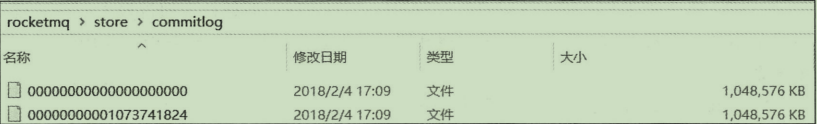
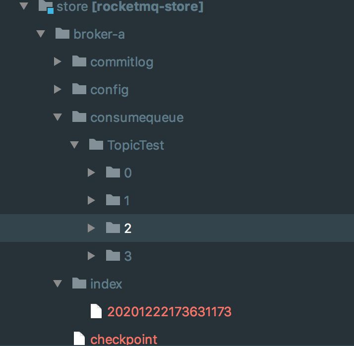
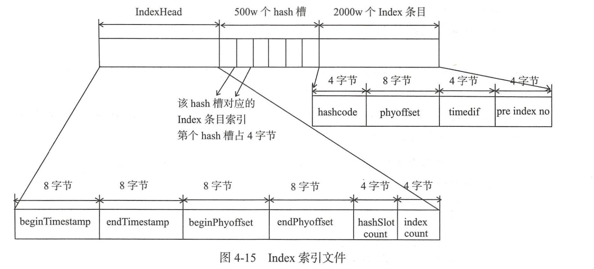
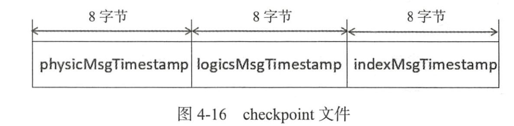
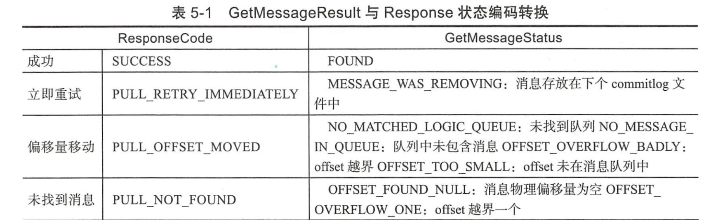
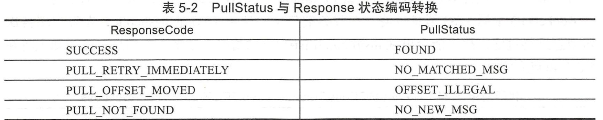
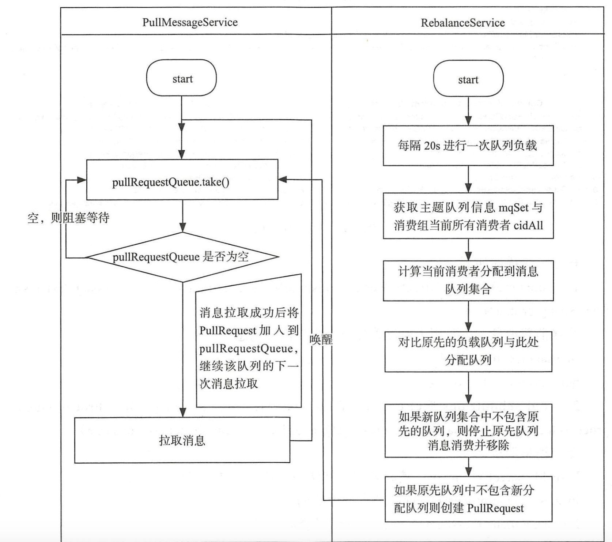

# RocketMQ源码解读

>源码debug:
>
>1. 首先github下载rocketmq的4.7.1的代码
>2. 配置nameserver(NamesrvController),broker(BrokerStartup)的ROCKETMQ_HOME=/Users/chenqi/IdeaProjects/rocketmq环境变量和
>program argument -c "/Users/chenqi/IdeaProjects/rocketmq/broker/src/main/resources/broker.conf"
>3.	依次启动namesrv/broker/producer/consumer


`requestCode 是broker和client之间数据处理的桥梁`

#问题?
- broker 双主的时候到底是怎么处理producer发送到的消息的,如果发送到master1,master2是怎么处理的呢?
> 猜测 如果正常逻辑,master1和master2的消息是不会同步,不同步的话消息会不一致?
- 读队列和写队列是如何工作的?
- consumer是如何定位到哪一个读队列,producer怎么选择哪一个写队列?

#第二章
NameServer如何保持一致?

    1. 服务注册(broker新增): broker启动的时候会向NameServer注册自己的信息
        2. 服务剔除(broker关闭或宕机):
       - broker主动关闭 会调用方法RouteInfoManager#unregisterBroker()
       - broker宕机 NameServer每隔10S会发送心跳包给broker探活,如果120s内没有回复则剔除broker
        3. 路由发现: producer/consumer 启动会主动拉取最新的路由
NameServer相互不通信如何保证一致?
        nameserver 集群之间不需要通信,broker服务启动的时候会向每一个NameServer注册自己的信息, producer会从NameServer之中获取broker的服务器信息

nameserver 动态路由发现与剔除机制?
    ap/cp 选型 zookeeper是cp的 强一致性,那么server是ap高可用,软一致性

NameServer启动流程
NameServer启动的时候,首先加载配置文件,然后启动了2个线程池 一个10s是扫描broker,一个是10分钟打印配置文件
初始化了netty remoteServer的必要参数. 然后注册了停止函数钩子(需要借鉴). 启动remoteServer netty.服务就启动了

broker启动 加载配置文件, 初始化很多定时任务, 通过netty包装了请求向namesrv发送连接

#第三章
1. 消息队列如何进行负载?
2. 消息发送如何实现高可用?
3. 批量消息发送如何实现一致?


producer发送消息基本流程:
验证消息->查找路由->消息发送
producer启动流程:
```
- producer.start();
    1. producer启动的时候会检查是否有producerGroup,然后把instanceName改为pid,避免同一个物理机启动2个producer无法启动
    2. 注册服务到MQClientInstance
    3. MQClientInstance启动,启动了如下的后台任务
    // Start request-response channel
    this.mQClientAPIImpl.start();
    // Start various schedule tasks
    this.startScheduledTask();
    // Start pull service
    this.pullMessageService.start();
    // Start rebalance service
    this.rebalanceService.start();
    // Start push service
    this.defaultMQProducer.getDefaultMQProducerImpl().start(false);

-  SendResult sendResult = producer.send(msg); 发送消息要先通过topic找到路由信息,然后找到对应的队列进行消息发送
查找路由信息 首先遍历broker然后遍历ConsumerQueue,所以如果是集群,查找的结构应该是:
broker-a-0,broker-a-1,broker-b-0,broker-b-1
```

具体如下:

```
this.defaultMQProducerImpl.send(msg) -> DefaultMQProducerImpl#sendDefaultImpl() ->
TopicPublishInfo topicPublishInfo = this.tryToFindTopicPublishInfo(msg.getTopic());
tryToFindTopicPublishInfo() 根据主题查找路由信息 -> 深入进去updateTopicRouteInfoFromNameServer() 从NameServer之中找到
路由信息之后,需要和本地缓存的topicRouteTable找到的TopicRouteData路由数据比较,如果数据改变了,会分别更新pub/sub的的路由信息.
topicRouteData2TopicPublishInfo(topic, topicRouteData);
for (int i = 0; i < qd.getWriteQueueNums(); i++) {
    MessageQueue mq = new MessageQueue(topic, qd.getBrokerName(), i);
    info.getMessageQueueList().add(mq);
}

```
 //选择一个MessageQueue
 MessageQueue mqSelected = this.selectOneMessageQueue(topicPublishInfo, lastBrokerName);
 当sendLatencyFaultEnable=true 延迟发送, 路由计算是:sendWhichQueue++%messageQueue.size()数量
 producer发送消息的时候会有故障检测,如果故障了 则会移除一段时间该broker.,移除的时间是下面计算的:
 updateFaultItem(final String brokerName, final long currentLatency, boolean isolation)里层方法
 computeNotAvailableDuration时间计算broker不参与消息发送队列负载,规避该broker.


 消息发送核心api
 - sendResult = this.sendKernelImpl(msg, mq, communicationMode, sendCallback, topicPublishInfo, timeout - costTime);
-> sendKernelImpl()这个很重要,里面封装把本地请求SendMessageRequestHeader(SendMessageRequestHeader implements CommandCustomHeader)
然后MQClientAPIImpl里面调用RemotingCommand.createRequestCommand()将SendMessageRequestHeader的请求头放入RemotingRequest,
后面会通过netty的channel.writeAndFlush(request) 进行请求发送.

上面看源码已经知道了producer发送消息到了broker,接下来我们看一下broker是如何处理的?
根据RequestCode.SEND_MESSAGE_V2进行匹配到rocketmq-broker服务的`AbstractSendMessageProcessor#parseRequestHeader`
SendMessageProcessor#asyncProcessRequest()调用了parseRequestHeader() ->
SendMessageRequestHeader requestHeader = parseRequestHeader(request);
->asyncSendMessage()

1. 首先检查消息是否合理
2. 消息重试是否达到最大重试次数,进入死信队列%DLQ%+消费组名
3. 调用putMessageResult = this.brokerController.getMessageStore().asyncPutMessage(msgInner); //存储消息


RocketMQ存储核心
三大组件:
CommitLog: 存储所有topic的消息文件
ConsumerQueue: CommitLog offset,文件大小size, tag hashcode. 主要用来给消费者消费的消息队列.消息到达CommitLog文件之后,将异步转发
到消息消费队列,给消息 消费者消费.
IndexFile: hash结构,key为hashcode,value为CommitLog offset. 消息索引文件

猜测IndexFile应该是索引文件,传递key的hashcode 直接找到CommitLog的消息文件

//DefaultMessageStore#asyncPutMessage()

putMessageResult = this.brokerController.getMessageStore().asyncPutMessage(msgInner);

从上面这行进行分析:

存储消息会调用`CompletableFuture<PutMessageResult> putResultFuture = this.commitLog.asyncPutMessage(msg);`
这里实现类为`CommitLog的asyncPutMessage(msg);`,然后处理消息的字段,处理CommitLog offset的逻辑,
`AppendMessageResult result = new AppendMessageResult(AppendMessageStatus.PUT_OK, wroteOffset, msgLen, msgId,
              msgInner.getStoreTimestamp(), queueOffset, CommitLog.this.defaultMessageStore.now() - beginTimeMills);`
会先将消息追加在内存中等待刷盘.

 //执行刷盘操作
handleDiskFlush(result, putMessageResult, msg);
//执行HA主从复制
 handleHA(result, putMessageResult, msg);


~~上面以前都是txt格式,后面会改为md格式放图以后好回顾~~

### MappedFileQueue
MappedFileQueue是MappedFile的文件管理容器,MappedFileQueue是对存储目录的封装.例如:CommitLog的存储目录为
${ROCKETMQ_HOME}/store/commitlog,该目录下会存在多个内存映射文件MappedFile.



### MappedFile

Java Memory-Mapped File所使用的内存分配在物理内存而不是JVM堆内存，且分配在OS内核。

每一个文件对应一个MappedFile.默认情况下大小位1g

```java
//通过上面我们知道消息发送是在asyncPutMessage()方法中
//那么MappedFile是如何创建并且维护的呢?
public CompletableFuture<PutMessageResult> asyncPutMessage(final MessageExtBrokerInner msg) {
  // ...省略
 MappedFile mappedFile = this.mappedFileQueue.getLastMappedFile();
  //...省略
  if (null == mappedFile || mappedFile.isFull()) {
                mappedFile = this.mappedFileQueue.getLastMappedFile(0); // Mark: NewFile may be cause noise
            }
}

```

```java
/**
     * 获取最后一个MappedFile,如果不存在或者已经满了,就创建
     * @param startOffset
     * @param needCreate
     * @return org.apache.rocketmq.store.MappedFile
     * @author chenqi
     * @date 2020/12/28 16:43
     */
    public MappedFile getLastMappedFile(final long startOffset, boolean needCreate) {
        //开始创建文件,-1时不创建
        long createOffset = -1;
        MappedFile mappedFileLast = getLastMappedFile();

        if (mappedFileLast == null) {
            createOffset = startOffset - (startOffset % this.mappedFileSize);
        }

        if (mappedFileLast != null && mappedFileLast.isFull()) {
            createOffset = mappedFileLast.getFileFromOffset() + this.mappedFileSize;
        }

        //创建文件
        if (createOffset != -1 && needCreate) {
            // 计算文件名。从此处我们可 以得知，MappedFile的文件命名规则：
            // 00000001000000000000 00100000000000000000 09000000000020000000二十位
            // fileName[n] = fileName[n - 1] + n * mappedFileSize fileName[0] = startOffset - (startOffset % this.mappedFileSize)
            String nextFilePath = this.storePath + File.separator + UtilAll.offset2FileName(createOffset);
            String nextNextFilePath = this.storePath + File.separator
                + UtilAll.offset2FileName(createOffset + this.mappedFileSize);

            MappedFile mappedFile = null;
            // 两种方式创建文件
            if (this.allocateMappedFileService != null) {
                //由allocateMappedFileService服务来维护MappedFile
               //查看资料https://my.oschina.net/u/4226611/blog/4353076
                mappedFile = this.allocateMappedFileService.putRequestAndReturnMappedFile(nextFilePath,
                    nextNextFilePath, this.mappedFileSize);
            } else {
                try {
                    //通过init()方法创建
                    mappedFile = new MappedFile(nextFilePath, this.mappedFileSize);
                } catch (IOException e) {
                    log.error("create mappedFile exception", e);
                }
            }
            
            //添加到mappedFile
            if (mappedFile != null) {
                if (this.mappedFiles.isEmpty()) {
                    mappedFile.setFirstCreateInQueue(true);
                }
                this.mappedFiles.add(mappedFile);
            }

            return mappedFile;
        }

        return mappedFileLast;
    }
```

```java
private void init(final String fileName, final int fileSize) throws IOException {
        this.fileName = fileName;
        this.fileSize = fileSize;
        this.file = new File(fileName);
        this.fileFromOffset = Long.parseLong(this.file.getName());
        boolean ok = false;

        ensureDirOK(this.file.getParent());

        try {
            this.fileChannel = new RandomAccessFile(this.file, "rw").getChannel();
            this.mappedByteBuffer = this.fileChannel.map(MapMode.READ_WRITE, 0, fileSize);
            TOTAL_MAPPED_VIRTUAL_MEMORY.addAndGet(fileSize);
            TOTAL_MAPPED_FILES.incrementAndGet();
            ok = true;
        } catch (FileNotFoundException e) {
            log.error("Failed to create file " + this.fileName, e);
            throw e;
        } catch (IOException e) {
            log.error("Failed to map file " + this.fileName, e);
            throw e;
        } finally {
            if (!ok && this.fileChannel != null) {
                this.fileChannel.close();
            }
        }
    }
```

现在已经知道MappedFile的文件的创建和内存映射,那么如何刷盘呢?

刷盘方式有三种：

| 线程服务              | 场景                           | 写消息性能 |
| --------------------- | ------------------------------ | ---------- |
| CommitRealTimeService | 异步刷盘 && 开启内存字节缓冲区 | 第一       |
| FlushRealTimeService  | 异步刷盘                       | 第二       |
| GroupCommitService    | 同步刷盘                       | 第三       |

` handleDiskFlush(result, putMessageResult, msg);`找到异步提交和刷盘`commitLogService.wakeup();`继续跟踪

```java
public void handleDiskFlush(AppendMessageResult result, PutMessageResult putMessageResult, MessageExt messageExt) {
	// 上面省略
    // Asynchronous flush
    else {
            //如果 堆外内存没有开启
            if (!this.defaultMessageStore.getMessageStoreConfig().isTransientStorePoolEnable()) {
                flushCommitLogService.wakeup();//进入
            } else {
              //唤醒的服务是CommitRealTimeServer
                commitLogService.wakeup();
            }
        }
}
```


### **FlushRealTimeService**

broker启动后，会启动许多服务线程，包括刷盘服务线程.,我们先搞清楚`FlushRealTimeService`的来龙去脉

```java
//初始化CommitLog的流程
//BrokerController->initialize()->new DefaultMessageStore(this.messageStoreConfig, this.brokerStatsManager, this.messageArrivingListener, this.brokerConfig)
//this.commitLog = new CommitLog(this);
public CommitLog(final DefaultMessageStore defaultMessageStore) {
        this.mappedFileQueue = new MappedFileQueue(defaultMessageStore.getMessageStoreConfig().getStorePathCommitLog(),
            defaultMessageStore.getMessageStoreConfig().getMappedFileSizeCommitLog(), defaultMessageStore.getAllocateMappedFileService());
        this.defaultMessageStore = defaultMessageStore;

        //同步调用
        if (FlushDiskType.SYNC_FLUSH == defaultMessageStore.getMessageStoreConfig().getFlushDiskType()) {
            this.flushCommitLogService = new GroupCommitService();
        } else {
            //异步调用
            this.flushCommitLogService = new FlushRealTimeService();
        }
        //构造commitLogService服务
        this.commitLogService = new CommitRealTimeService();

        this.appendMessageCallback = new DefaultAppendMessageCallback(defaultMessageStore.getMessageStoreConfig().getMaxMessageSize());
        batchEncoderThreadLocal = new ThreadLocal<MessageExtBatchEncoder>() {
            @Override
            protected MessageExtBatchEncoder initialValue() {
                return new MessageExtBatchEncoder(defaultMessageStore.getMessageStoreConfig().getMaxMessageSize());
            }
        };
        this.putMessageLock = defaultMessageStore.getMessageStoreConfig().isUseReentrantLockWhenPutMessage() ? new PutMessageReentrantLock() : new PutMessageSpinLock();

    }
```

```java
//启动服务
public void start() {
  			//调用FlushRealTimeService()服务的run()方法
        this.flushCommitLogService.start();

        if (defaultMessageStore.getMessageStoreConfig().isTransientStorePoolEnable()) {
          //调用CommitRealTimeService提交消息到内存并映射物理文件
            this.commitLogService.start();
        }
    }
```

CommitLog的父类是`DefaultMessageStore`,然后是在`BrokerController#start()`方法中调用`this.messageStore.start();`启动服务.

`CommitRealTimeService#start()->run()`

```java
class CommitRealTimeService extends FlushCommitLogService {

        private long lastCommitTimestamp = 0;

        @Override
        public String getServiceName() {
            return CommitRealTimeService.class.getSimpleName();
        }

        @Override
        public void run() {
            CommitLog.log.info(this.getServiceName() + " service started");
            while (!this.isStopped()) {
                int interval = CommitLog.this.defaultMessageStore.getMessageStoreConfig().getCommitIntervalCommitLog();

                int commitDataLeastPages = CommitLog.this.defaultMessageStore.getMessageStoreConfig().getCommitCommitLogLeastPages();

                int commitDataThoroughInterval =
                    CommitLog.this.defaultMessageStore.getMessageStoreConfig().getCommitCommitLogThoroughInterval();

                long begin = System.currentTimeMillis();
                if (begin >= (this.lastCommitTimestamp + commitDataThoroughInterval)) {
                    this.lastCommitTimestamp = begin;
                    commitDataLeastPages = 0;
                }

                try {
                    boolean result = CommitLog.this.mappedFileQueue.commit(commitDataLeastPages);
                    long end = System.currentTimeMillis();
                    //判断是否应该刷盘,根据上面commit的提交来判断的,如果为false就需要刷盘
                    if (!result) {
                        this.lastCommitTimestamp = end; // result = false means some data committed.
                        //now wake up flush thread.
                        //唤醒刷盘服务
                        flushCommitLogService.wakeup();
                    }

                    if (end - begin > 500) {
                        log.info("Commit data to file costs {} ms", end - begin);
                    }
                    this.waitForRunning(interval);
                } catch (Throwable e) {
                    CommitLog.log.error(this.getServiceName() + " service has exception. ", e);
                }
            }

            //重试提交
            boolean result = false;
            for (int i = 0; i < RETRY_TIMES_OVER && !result; i++) {
                result = CommitLog.this.mappedFileQueue.commit(0);
                CommitLog.log.info(this.getServiceName() + " service shutdown, retry " + (i + 1) + " times " + (result ? "OK" : "Not OK"));
            }
            CommitLog.log.info(this.getServiceName() + " service end");
        }
    }
```

`CommitLog.this.mappedFileQueue.commit(commitDataLeastPages);`分析`commit(commitDataLeastPages)`

```java
public boolean commit(final int commitLeastPages) {
        boolean result = true;
        //通过offset找到MappedFile
        MappedFile mappedFile = this.findMappedFileByOffset(this.committedWhere, this.committedWhere == 0);
        if (mappedFile != null) {
            //主要看commit
            int offset = mappedFile.commit(commitLeastPages);
            long where = mappedFile.getFileFromOffset() + offset;
            result = where == this.committedWhere;
            this.committedWhere = where;
        }

        return result;
    }

/**
     * 提交数据到磁盘
     * @param commitLeastPages 最小提交页数
     * @return int
     * @author chenqi
     * @date 2020/12/28 19:21
    */
    public int commit(final int commitLeastPages) {
        if (writeBuffer == null) {
            //no need to commit data to file channel, so just regard wrotePosition as committedPosition.
            return this.wrotePosition.get();
        }
        //判断是否能提交
        if (this.isAbleToCommit(commitLeastPages)) {
            if (this.hold()) {
                commit0(commitLeastPages); 
                this.release();
            } else {
                log.warn("in commit, hold failed, commit offset = " + this.committedPosition.get());
            }
        }

        // All dirty data has been committed to FileChannel.
        if (writeBuffer != null && this.transientStorePool != null && this.fileSize == this.committedPosition.get()) {
            this.transientStorePool.returnBuffer(writeBuffer);
            this.writeBuffer = null;
        }

        return this.committedPosition.get();
    }

    protected void commit0(final int commitLeastPages) {
        int writePos = this.wrotePosition.get();
        int lastCommittedPosition = this.committedPosition.get();

        //判断还有未提交的数据
        if (writePos - this.committedPosition.get() > 0) {
            try {
                //writeBuffer在appendMessagesInner()的逻辑中进行过赋值
                //创建writeBuffer的共享缓存区
                ByteBuffer byteBuffer = writeBuffer.slice();
                //设置position位置
                byteBuffer.position(lastCommittedPosition);
                //设置limit
                byteBuffer.limit(writePos);
                //把lastCommittedPosition写入发哦FileChannelPosition中
                this.fileChannel.position(lastCommittedPosition);
                //将数据提交到文件通道FileChannel,还是在内存之中
                this.fileChannel.write(byteBuffer);
                this.committedPosition.set(writePos);
            } catch (Throwable e) {
                log.error("Error occurred when commit data to FileChannel.", e);
            }
        }
    }
```

上面只看了`commit()`方法,将数据写入内存,那么是什么时候刷到磁盘的呢?

上文说到还有一个线程也会启动就是`FlushRealTimeService#run()`

```java
class FlushRealTimeService extends FlushCommitLogService {


        public void run() {
				//忽略上下文            
                    long begin = System.currentTimeMillis();
                    CommitLog.this.mappedFileQueue.flush(flushPhysicQueueLeastPages);
                    long storeTimestamp = CommitLog.this.mappedFileQueue.getStoreTimestamp();
        }
}
```

`CommitLog.this.mappedFileQueue.flush(flushPhysicQueueLeastPages);`->`MappedFileQueue#flush()`->

`MappedFile#flush()`

```java
/**
     * @return The current flushed position
     *
     */
    public int flush(final int flushLeastPages) {
        //校验是否能够flush
        if (this.isAbleToFlush(flushLeastPages)) {
            if (this.hold()) {
                int value = getReadPosition();

                try {
                    //调用mappedByteBuffer/fileChannel的force方法将内存的数据持久化到磁盘上
                    if (writeBuffer != null || this.fileChannel.position() != 0) {
                        this.fileChannel.force(false);
                    } else {
                        this.mappedByteBuffer.force();
                    }
                } catch (Throwable e) {
                    log.error("Error occurred when force data to disk.", e);
                }

                this.flushedPosition.set(value);
                this.release();
            } else {
                log.warn("in flush, hold failed, flush offset = " + this.flushedPosition.get());
                this.flushedPosition.set(getReadPosition());
            }
        }
        return this.getFlushedPosition();
    }
```

# 第四章

- CommitLog:存储所有的消息,文件的集合,每个文件默认1G大小.当第一个文件写满了,第二个文件会以初始偏移量命名.比如其实偏移量1080802673,第二个文件名为00000000001080802673,以此类推.CommitLog的内容在消费之后是不会被删除的,支持消息回溯,可以随时搜索.

- ConsumeQueue:CommitLog的索引文件,消息消费队列是RocketMQ专门为消息订阅的索引文件,提高消息检索速度.一个Topic可以有多个ConsumerQueue,每一个文件代表一个逻辑队列.

  从实际的物理存储来说,ConsumeQueue对应每个Topic和QueueId下面的文件,单个文件30W条数据组成,大小600万字节(约5.72M).当一个ConsumeQueue类型的文件写满了,则写下一个文件

  

- Index:引入Hash索引机制为消息建立索引

  单个IndexFile可以保存2000W个索引,文件大小约为400M

  索引的目的在于根据关键字快速定位消息.

  

- CheckPoint CommitLog,ConsumeQueue,IndexFile 文件的刷盘时间点,存储格式为

  

physicMsgTimestamp: CommitLog文件刷盘时间点

logicsMsgTimestamp: ConsumeQueue文件刷盘时间点

indexMsgTimestamp: IndexFile文件刷盘时间点

## 过期文件删除策略

由于RocketMQ被消费过的消息是不会被删除的,所以保证的消息的顺序写如.如果不清理文件的话,文件数量不断的增加,最终会导致磁盘可用空间越来越少.

所以主要要清理的文件为CommitLog,ConsumeQueue的过期文件.

删除策略:

- 通过定时任务,每天凌晨4点执行*默认超过72小时的文件为过期文件*进行删除
- 磁盘使用空间超过75%,开始删除过期文件
- 如果磁盘使用率超过85%,开始批量清理文件,不管是否过期,直到空间充足
- 如果磁盘使用率超过90%,拒绝消息写入

以下我们查看源码追踪:

`DefaultMessageStore#addScheduleTask()`

```java
private void addScheduleTask() {

        this.scheduledExecutorService.scheduleAtFixedRate(new Runnable() {
            @Override
            public void run() {
              //每10s定期清理文件
                DefaultMessageStore.this.cleanFilesPeriodically();
            }
        }, 1000 * 60, this.messageStoreConfig.getCleanResourceInterval(), TimeUnit.MILLISECONDS);

        this.scheduledExecutorService.scheduleAtFixedRate(new Runnable() {
            @Override
            public void run() {
              //CommitLog自我检查
                DefaultMessageStore.this.checkSelf();
            }
        }, 1, 10, TimeUnit.MINUTES);
  

        this.diskCheckScheduledExecutorService.scheduleAtFixedRate(new Runnable() {
            public void run() {
              //空间是否满了
                DefaultMessageStore.this.cleanCommitLogService.isSpaceFull();
            }
        }, 1000L, 10000L, TimeUnit.MILLISECONDS);
    }
```

```java
	/**
     * commitLog清除和ConsumeQueue清除服务
     * @return void
     * @author chenqi
     * @date 2021/1/4 10:09
     */
    private void cleanFilesPeriodically() {
        this.cleanCommitLogService.run();
        this.cleanConsumeQueueService.run();
    }

public void run() {
            try {
              //删除
                this.deleteExpiredFiles();

                this.redeleteHangedFile();
            } catch (Throwable e) {
                DefaultMessageStore.log.warn(this.getServiceName() + " service has exception. ", e);
            }
        }
```

```java
private void deleteExpiredFiles() {
            int deleteCount = 0;
            long fileReservedTime = DefaultMessageStore.this.getMessageStoreConfig().getFileReservedTime();
            int deletePhysicFilesInterval = DefaultMessageStore.this.getMessageStoreConfig().getDeleteCommitLogFilesInterval();
            int destroyMapedFileIntervalForcibly = DefaultMessageStore.this.getMessageStoreConfig().getDestroyMapedFileIntervalForcibly();

            //通过deleteWhen设置一天的固定执行一次删除,默认为凌晨4点
            boolean timeup = this.isTimeToDelete();
            //磁盘空间是否充足,如果磁盘空间不充足 返回true 立即执行删除
            boolean spacefull = this.isSpaceToDelete();
            //预留 手工触发删除策略
            boolean manualDelete = this.manualDeleteFileSeveralTimes > 0;

            if (timeup || spacefull || manualDelete) {

                if (manualDelete)
                    this.manualDeleteFileSeveralTimes--;

                boolean cleanAtOnce = DefaultMessageStore.this.getMessageStoreConfig().isCleanFileForciblyEnable() && this.cleanImmediately;

                log.info("begin to delete before {} hours file. timeup: {} spacefull: {} manualDeleteFileSeveralTimes: {} cleanAtOnce: {}",
                    fileReservedTime,
                    timeup,
                    spacefull,
                    manualDeleteFileSeveralTimes,
                    cleanAtOnce);

                //过期时间
                fileReservedTime *= 60 * 60 * 1000;
 //入参分析: 删除文件的过期时间,两次删除文件的间隔时间,强制销毁映射文件,是否立刻执行
                deleteCount = DefaultMessageStore.this.commitLog.deleteExpiredFile(fileReservedTime, deletePhysicFilesInterval,
                    destroyMapedFileIntervalForcibly, cleanAtOnce);
                if (deleteCount > 0) {
                } else if (spacefull) {
                    log.warn("disk space will be full soon, but delete file failed.");
                }
            }
        }
```

`磁盘使用率`

```java
private boolean isSpaceToDelete() {
            //获得磁盘最大使用率
            double ratio = DefaultMessageStore.this.getMessageStoreConfig().getDiskMaxUsedSpaceRatio() / 100.0;

            cleanImmediately = false;

            {
                String storePathPhysic = DefaultMessageStore.this.getMessageStoreConfig().getStorePathCommitLog();
                //CommitLog目录所在的磁盘分区使用率
                double physicRatio = UtilAll.getDiskPartitionSpaceUsedPercent(storePathPhysic);
                if (physicRatio > diskSpaceWarningLevelRatio) {
                    //如果当前磁盘使用率>0.9 磁盘拒绝写入消息
                    boolean diskok = DefaultMessageStore.this.runningFlags.getAndMakeDiskFull();
                    if (diskok) {
                        DefaultMessageStore.log.error("physic disk maybe full soon " + physicRatio + ", so mark disk full");
                    }

                    cleanImmediately = true;
                } else if (physicRatio > diskSpaceCleanForciblyRatio) {
                    //如果当前磁盘使用率>0.85 立即执行删除
                    cleanImmediately = true;
                } else {
                    //磁盘使用率<0.85 为正常 返回true
                    boolean diskok = DefaultMessageStore.this.runningFlags.getAndMakeDiskOK();
                    if (!diskok) {
                        DefaultMessageStore.log.info("physic disk space OK " + physicRatio + ", so mark disk ok");
                    }
                }

                if (physicRatio < 0 || physicRatio > ratio) {
                    DefaultMessageStore.log.info("physic disk maybe full soon, so reclaim space, " + physicRatio);
                    return true;
                }
            }

            {
                //获得ConsumeQueue逻辑路径,与上面逻辑一致
                String storePathLogics = StorePathConfigHelper
                    .getStorePathConsumeQueue(DefaultMessageStore.this.getMessageStoreConfig().getStorePathRootDir());
                double logicsRatio = UtilAll.getDiskPartitionSpaceUsedPercent(storePathLogics);
                if (logicsRatio > diskSpaceWarningLevelRatio) {
                    boolean diskok = DefaultMessageStore.this.runningFlags.getAndMakeDiskFull();
                    if (diskok) {
                        DefaultMessageStore.log.error("logics disk maybe full soon " + logicsRatio + ", so mark disk full");
                    }

                    cleanImmediately = true;
                } else if (logicsRatio > diskSpaceCleanForciblyRatio) {
                    cleanImmediately = true;
                } else {
                    boolean diskok = DefaultMessageStore.this.runningFlags.getAndMakeDiskOK();
                    if (!diskok) {
                        DefaultMessageStore.log.info("logics disk space OK " + logicsRatio + ", so mark disk ok");
                    }
                }

                if (logicsRatio < 0 || logicsRatio > ratio) {
                    DefaultMessageStore.log.info("logics disk maybe full soon, so reclaim space, " + logicsRatio);
                    return true;
                }
            }

            return false;
        }
```

# 第五章

- 消息队列的负载与重新分布

- 消息消费模式(集群/广播)

- 消息拉取方式(push(实际上也是pull)/pull)

- 消息进度反馈

- 消息过滤

- 顺序消息


## Consumer启动


quickstart.Consumer启动源码跟踪:

`consumer.start();`->`this.defaultMQPushConsumerImpl.start();`

```java
public synchronized void start() throws MQClientException {
        switch (this.serviceState) {
            case CREATE_JUST:
                log.info("the consumer [{}] start beginning. messageModel={}, isUnitMode={}", this.defaultMQPushConsumer.getConsumerGroup(),
                    this.defaultMQPushConsumer.getMessageModel(), this.defaultMQPushConsumer.isUnitMode());
                this.serviceState = ServiceState.START_FAILED;
                //配置检查
                this.checkConfig();
                //构造SubscriptionData
                this.copySubscription();

                if (this.defaultMQPushConsumer.getMessageModel() == MessageModel.CLUSTERING) {
                    this.defaultMQPushConsumer.changeInstanceNameToPID();
                }

                //初始化MQClientInstance
                this.mQClientFactory = MQClientManager.getInstance().getOrCreateMQClientInstance(this.defaultMQPushConsumer, this.rpcHook);
                //rebanlanceImpl-消息重新负载实现类
                //设置消费者组
                this.rebalanceImpl.setConsumerGroup(this.defaultMQPushConsumer.getConsumerGroup());
                //设置消费者消息模式
                this.rebalanceImpl.setMessageModel(this.defaultMQPushConsumer.getMessageModel());
                //设置消息分配策略
                this.rebalanceImpl.setAllocateMessageQueueStrategy(this.defaultMQPushConsumer.getAllocateMessageQueueStrategy());
                this.rebalanceImpl.setmQClientFactory(this.mQClientFactory);

                this.pullAPIWrapper = new PullAPIWrapper(
                    mQClientFactory,
                    this.defaultMQPushConsumer.getConsumerGroup(), isUnitMode());
                this.pullAPIWrapper.registerFilterMessageHook(filterMessageHookList);

                if (this.defaultMQPushConsumer.getOffsetStore() != null) {
                    this.offsetStore = this.defaultMQPushConsumer.getOffsetStore();
                } else {
                    //初始化消息进度
                    switch (this.defaultMQPushConsumer.getMessageModel()) {
                        case BROADCASTING:
                            //广播消费消息,消息存储在消费端本地
                            this.offsetStore = new LocalFileOffsetStore(this.mQClientFactory, this.defaultMQPushConsumer.getConsumerGroup());
                            break;
                        case CLUSTERING:
                            //集群模式,消息消费保存在broker上
                            this.offsetStore = new RemoteBrokerOffsetStore(this.mQClientFactory, this.defaultMQPushConsumer.getConsumerGroup());
                            break;
                        default:
                            break;
                    }
                    this.defaultMQPushConsumer.setOffsetStore(this.offsetStore);
                }
                this.offsetStore.load();

                //判断是否为顺序消息消费,创建消息消费端线程服务
                if (this.getMessageListenerInner() instanceof MessageListenerOrderly) {
                    this.consumeOrderly = true;
                    this.consumeMessageService =
                        new ConsumeMessageOrderlyService(this, (MessageListenerOrderly) this.getMessageListenerInner());
                } else if (this.getMessageListenerInner() instanceof MessageListenerConcurrently) {
                    this.consumeOrderly = false;
                    this.consumeMessageService =
                        new ConsumeMessageConcurrentlyService(this, (MessageListenerConcurrently) this.getMessageListenerInner());
                }
                //启动consume服务
                this.consumeMessageService.start();

                boolean registerOK = mQClientFactory.registerConsumer(this.defaultMQPushConsumer.getConsumerGroup(), this);
                if (!registerOK) {
                    this.serviceState = ServiceState.CREATE_JUST;
                    this.consumeMessageService.shutdown(defaultMQPushConsumer.getAwaitTerminationMillisWhenShutdown());
                    throw new MQClientException("The consumer group[" + this.defaultMQPushConsumer.getConsumerGroup()
                        + "] has been created before, specify another name please." + FAQUrl.suggestTodo(FAQUrl.GROUP_NAME_DUPLICATE_URL),
                        null);
                }

                //mq客户端服务,producer和consumer都只会启动一个MQClientInstance实例
                //this.pullMessageService.start();
                //this.rebalanceService.start();
                mQClientFactory.start();
                log.info("the consumer [{}] start OK.", this.defaultMQPushConsumer.getConsumerGroup());
                this.serviceState = ServiceState.RUNNING;
                break;
            case RUNNING:
            case START_FAILED:
            case SHUTDOWN_ALREADY:
                throw new MQClientException("The PushConsumer service state not OK, maybe started once, "
                    + this.serviceState
                    + FAQUrl.suggestTodo(FAQUrl.CLIENT_SERVICE_NOT_OK),
                    null);
            default:
                break;
        }

        this.updateTopicSubscribeInfoWhenSubscriptionChanged();
        this.mQClientFactory.checkClientInBroker();
        this.mQClientFactory.sendHeartbeatToAllBrokerWithLock();
        this.mQClientFactory.rebalanceImmediately();
    }
```

`mQClientFactory.start();`启动创建了MQClientInstance,`this.pullMessageService.start();`pullMessageService服务运行,调用`run()`

```java
@Override
    public void run() {
        log.info(this.getServiceName() + " service started");

        while (!this.isStopped()) {
            try {
                //从pullRequestQueue队列中取出PullRequest
                PullRequest pullRequest = this.pullRequestQueue.take();
                this.pullMessage(pullRequest);
            } catch (InterruptedException ignored) {
            } catch (Exception e) {
                log.error("Pull Message Service Run Method exception", e);
            }
        }

        log.info(this.getServiceName() + " service end");
    }
```

根据上面代码查看发现PullRequest是从PullRequestQueue队列中获取的,那么PullRequest是什么时候添加的呢?

```java
/**
     * 延迟执行拉取请求
     * @param pullRequest
     * @param timeDelay
     * @return void
     * @author chenqi
     * @date 2021/1/5 13:16
     */
    public void executePullRequestLater(final PullRequest pullRequest, final long timeDelay) {
        if (!isStopped()) {
            this.scheduledExecutorService.schedule(new Runnable() {
                @Override
                public void run() {
                    PullMessageService.this.executePullRequestImmediately(pullRequest);
                }
            }, timeDelay, TimeUnit.MILLISECONDS);
        } else {
            log.warn("PullMessageServiceScheduledThread has shutdown");
        }
    }
    /**
     * 立即执行拉取请求
     * @param pullRequest
     * @return void
     * @author chenqi
     * @date 2021/1/5 13:16
     */
    public void executePullRequestImmediately(final PullRequest pullRequest) {
        try {
            this.pullRequestQueue.put(pullRequest);
        } catch (InterruptedException e) {
            log.error("executePullRequestImmediately pullRequestQueue.put", e);
        }
    }
```

什么时候会执行上述的方法呢?答案就在`public void pullMessage(final PullRequest pullRequest) `中,`switch (pullResult.getPullStatus()) `中调用了`DefaultMQPushConsumerImpl.this.executePullRequestImmediately(pullRequest);`.

大概意思是PullRequest拉取任务执行完一次拉取任务后,有将PullRequest放入PullRequestQueue.

## Consumer拉取消息

分析`pullMessage(final PullRequest pullRequest)`.

```java
//DefaultMQPushConsumerImpl#pullMessage
//从PullRequest获取ProcessQueue队列
final ProcessQueue processQueue = pullRequest.getProcessQueue();
//当前队列是否被丢弃
if (processQueue.isDropped()) {
  log.info("the pull request[{}] is dropped.", pullRequest.toString());
  return;
}
//pullMessage(final PullRequest pullRequest)
pullRequest.getProcessQueue().setLastPullTimestamp(System.currentTimeMillis());

try {
  //确认消息的状态
  this.makeSureStateOK();
} catch (MQClientException e) {
  log.warn("pullMessage exception, consumer state not ok", e);
  this.executePullRequestLater(pullRequest, pullTimeDelayMillsWhenException);
  return;
}
//如果当前消费者被挂起,则将拉取任务延迟1s再次放入到PullMessageService队列中
if (this.isPause()) {
  log.warn("consumer was paused, execute pull request later. instanceName={}, group={}", this.defaultMQPushConsumer.getInstanceName(), this.defaultMQPushConsumer.getConsumerGroup());
  this.executePullRequestLater(pullRequest, PULL_TIME_DELAY_MILLS_WHEN_SUSPEND);
  return;
}
```


下面的代码是进行消息的流控,有2个维度,消息的数量,大小,跨度

```java
//如果消息的数量 大于  消息拉取的最大数量
if (cachedMessageCount > this.defaultMQPushConsumer.getPullThresholdForQueue()) {
  //放入延迟队列,延迟50ms
  this.executePullRequestLater(pullRequest, PULL_TIME_DELAY_MILLS_WHEN_FLOW_CONTROL);
  if ((queueFlowControlTimes++ % 1000) == 0) {
    log.warn(
      "the cached message count exceeds the threshold {}, so do flow control, minOffset={}, maxOffset={}, count={}, size={} MiB, pullRequest={}, flowControlTimes={}",
      this.defaultMQPushConsumer.getPullThresholdForQueue(), processQueue.getMsgTreeMap().firstKey(), processQueue.getMsgTreeMap().lastKey(), cachedMessageCount, cachedMessageSizeInMiB, pullRequest, queueFlowControlTimes);
  }
  return;
}

//如果消息大小 大于 消息拉取的大小
if (cachedMessageSizeInMiB > this.defaultMQPushConsumer.getPullThresholdSizeForQueue()) {
  //放入延迟队列,延迟50ms
  this.executePullRequestLater(pullRequest, PULL_TIME_DELAY_MILLS_WHEN_FLOW_CONTROL);
  if ((queueFlowControlTimes++ % 1000) == 0) {
    log.warn(
      "the cached message size exceeds the threshold {} MiB, so do flow control, minOffset={}, maxOffset={}, count={}, size={} MiB, pullRequest={}, flowControlTimes={}",
      this.defaultMQPushConsumer.getPullThresholdSizeForQueue(), processQueue.getMsgTreeMap().firstKey(), processQueue.getMsgTreeMap().lastKey(), cachedMessageCount, cachedMessageSizeInMiB, pullRequest, queueFlowControlTimes);
  }
  return;
}
if (!this.consumeOrderly) {
//队列最大的跨度 大于 消费者消费时处理队列最大跨度 就延迟拉取消息
  if (processQueue.getMaxSpan() > this.defaultMQPushConsumer.getConsumeConcurrentlyMaxSpan()) {
    this.executePullRequestLater(pullRequest, PULL_TIME_DELAY_MILLS_WHEN_FLOW_CONTROL);
    if ((queueMaxSpanFlowControlTimes++ % 1000) == 0) {
      log.warn(
        "the queue's messages, span too long, so do flow control, minOffset={}, maxOffset={}, maxSpan={}, pullRequest={}, flowControlTimes={}",
        processQueue.getMsgTreeMap().firstKey(), processQueue.getMsgTreeMap().lastKey(), processQueue.getMaxSpan(),
        pullRequest, queueMaxSpanFlowControlTimes);
    }
    return;
  }
}
```

获得订阅数据

```java
 //获得订阅数据,如果为null 延迟拉取.
final SubscriptionData subscriptionData = this.rebalanceImpl.getSubscriptionInner().get(pullRequest.getMessageQueue().getTopic());
if (null == subscriptionData) {
  this.executePullRequestLater(pullRequest, pullTimeDelayMillsWhenException);
  log.warn("find the consumer's subscription failed, {}", pullRequest);
  return;
}
```

构建参数,与broker进行交互

```java

//构建消息拉取的系统标记
int sysFlag = PullSysFlag.buildSysFlag(
  commitOffsetEnable, // commitOffset
  true, // suspend
  subExpression != null, // subscription
  classFilter // class filter
);
//pullKernelImpl与broker服务端进行交互
this.pullAPIWrapper.pullKernelImpl(
  pullRequest.getMessageQueue(),
  subExpression,
  subscriptionData.getExpressionType(),
  subscriptionData.getSubVersion(),
  pullRequest.getNextOffset(),
  this.defaultMQPushConsumer.getPullBatchSize(),
  sysFlag,
  commitOffsetValue,
  BROKER_SUSPEND_MAX_TIME_MILLIS,
  CONSUMER_TIMEOUT_MILLIS_WHEN_SUSPEND,
  CommunicationMode.ASYNC,
  pullCallback
);
```


```java
//根据brokerName和brokerId从MQClientInstance中获取broker地址
FindBrokerResult findBrokerResult =
            this.mQClientFactory.findBrokerAddressInSubscribe(mq.getBrokerName(),
                this.recalculatePullFromWhichNode(mq), false);

        if (null == findBrokerResult) {
            this.mQClientFactory.updateTopicRouteInfoFromNameServer(mq.getTopic());
            findBrokerResult =
                this.mQClientFactory.findBrokerAddressInSubscribe(mq.getBrokerName(),
                    this.recalculatePullFromWhichNode(mq), false);
        }
```

最后通过`this.mQClientFactory.getMQClientAPIImpl().pullMessage`发送消息到broker,请求头为`RequestCode.PULL_MESSAGE`.

```
PullResult pullResult = this.mQClientFactory.getMQClientAPIImpl().pullMessage(
    brokerAddr,
    requestHeader,
    timeoutMillis,
    communicationMode,
    pullCallback);
```


## broker响应消息

接下来我们查看broker端怎么处理`RequestCode.PULL_MESSAGE`的请求.broker端解析器为`PullMessageProcessor#processRequest`

方法太长不放上来了

- 首先根据订阅消息,构建过滤器

- 调用`MessageStore.getMessage`查找消息

- 根据主题名称与队列编号编号获取消费队列

  ```java
  GetMessageStatus status = GetMessageStatus.NO_MESSAGE_IN_QUEUE;
  long nextBeginOffset = offset;  //consumer传递过来的偏移量
  long minOffset = 0;
  long maxOffset = 0;
  
  GetMessageResult getResult = new GetMessageResult();
  
  final long maxOffsetPy = this.commitLog.getMaxOffset();  //获得commitLog的最大偏移量
  
  ConsumeQueue consumeQueue = findConsumeQueue(topic, queueId);
  ```

- 消息偏移量校对

  ```java
  if (maxOffset == 0) {  //表示当前消费队列中没有消息
    status = GetMessageStatus.NO_MESSAGE_IN_QUEUE;
    //如果broker为主节点,下次拉取偏移量为0,否则为offset
    nextBeginOffset = nextOffsetCorrection(offset, 0);
  } else if (offset < minOffset) {   //consumer想拉取的偏移量 小于 最小的偏移量
    status = GetMessageStatus.OFFSET_TOO_SMALL;
    //如果broker为主节点,下次拉取偏移量为minOffset,否则为offset
    nextBeginOffset = nextOffsetCorrection(offset, minOffset);
  } else if (offset == maxOffset) {  //如果待拉取偏移量等于队列最大偏移量
    status = GetMessageStatus.OFFSET_OVERFLOW_ONE;
    nextBeginOffset = nextOffsetCorrection(offset, offset);
  } else if (offset > maxOffset) {  //如果待拉取偏移量 大于 最大偏移量 偏移量越界
    status = GetMessageStatus.OFFSET_OVERFLOW_BADLY;
    if (0 == minOffset) {
      nextBeginOffset = nextOffsetCorrection(offset, minOffset);
    } else {
      nextBeginOffset = nextOffsetCorrection(offset, maxOffset);
    }
  }
  ```

- 如果待拉取偏移量大于minOffset小于maxOffset,从当前offset处尝试拉取32条消息,根据消息队列偏移量(ConsumeQueue)从CommitLog文件中查找消息

- 根据PullResult填充ResponseHeader的nextBeginOffset,minOffset,maxOffset

  ```java
  response.setRemark(getMessageResult.getStatus().name());
  responseHeader.setNextBeginOffset(getMessageResult.getNextBeginOffset());
  responseHeader.setMinOffset(getMessageResult.getMinOffset());
  responseHeader.setMaxOffset(getMessageResult.getMaxOffset());
  ```

- 根据主从同步延迟,如果从节点数据包含下一次拉取的偏移量,设置下一次拉取任务的taskId

- 根据GetMessageResult编码转换关系

  

- 如果CommitLog标记可用,并且当前节点为主节点,则更新消费进度

  ```java
  boolean storeOffsetEnable = brokerAllowSuspend;
          storeOffsetEnable = storeOffsetEnable && hasCommitOffsetFlag;
          storeOffsetEnable = storeOffsetEnable
              && this.brokerController.getMessageStoreConfig().getBrokerRole() != BrokerRole.SLAVE;
          if (storeOffsetEnable) { //如果CommitLog标记可用,并且当前节点为主节点,则更新消费进度
              this.brokerController.getConsumerOffsetManager().commitOffset(RemotingHelper.parseChannelRemoteAddr(channel),
                  requestHeader.getConsumerGroup(), requestHeader.getTopic(), requestHeader.getQueueId(), requestHeader.getCommitOffset());
          }
  ```

  ## Consumer收到响应消息之后的处理

  消息发送请求给客户端是调用`this.pullMessageAsync(addr, request, timeoutMillis, pullCallback);`发送请求到broker,broker处理完请求把响应结果response返回来,然后解析response

  ```java
  public PullResult pullMessage(
          final String addr,
          final PullMessageRequestHeader requestHeader,
          final long timeoutMillis,
          final CommunicationMode communicationMode,
          final PullCallback pullCallback
      ) throws RemotingException, MQBrokerException, InterruptedException {
          RemotingCommand request = RemotingCommand.createRequestCommand(RequestCode.PULL_MESSAGE, requestHeader);
  
          switch (communicationMode) {
              case ONEWAY:
                  assert false;
                  return null;
              case ASYNC:
                  this.pullMessageAsync(addr, request, timeoutMillis, pullCallback);
                  return null;
              case SYNC:
                  return this.pullMessageSync(addr, request, timeoutMillis);
              default:
                  assert false;
                  break;
          }
  
          return null;
      }
  
      private void pullMessageAsync(
          final String addr,
          final RemotingCommand request,
          final long timeoutMillis,
          final PullCallback pullCallback
      ) throws RemotingException, InterruptedException {
          this.remotingClient.invokeAsync(addr, request, timeoutMillis, new InvokeCallback() {
              @Override
              public void operationComplete(ResponseFuture responseFuture) {
                  RemotingCommand response = responseFuture.getResponseCommand();
                  if (response != null) {
                      try {
                          //拉取broker的响应结果
                          PullResult pullResult = MQClientAPIImpl.this.processPullResponse(response);
                          assert pullResult != null;
                          //将响应结果放入pullCallback
                          pullCallback.onSuccess(pullResult);
                      } catch (Exception e) {
                          pullCallback.onException(e);
                      }
                  } else {
                      if (!responseFuture.isSendRequestOK()) {
                          pullCallback.onException(new MQClientException("send request failed to " + addr + ". Request: " + request, responseFuture.getCause()));
                      } else if (responseFuture.isTimeout()) {
                          pullCallback.onException(new MQClientException("wait response from " + addr + " timeout :" + responseFuture.getTimeoutMillis() + "ms" + ". Request: " + request,
                              responseFuture.getCause()));
                      } else {
                          pullCallback.onException(new MQClientException("unknown reason. addr: " + addr + ", timeoutMillis: " + timeoutMillis + ". Request: " + request, responseFuture.getCause()));
                      }
                  }
              }
          });
      }
  ```

- 根据响应结果解码成PullResultExt对象,此时只是从网络中读取消息列表到byte[] messageBinary属性

  ```java
  private PullResult processPullResponse(
          final RemotingCommand response) throws MQBrokerException, RemotingCommandException {
          PullStatus pullStatus = PullStatus.NO_NEW_MSG;
          switch (response.getCode()) {
              case ResponseCode.SUCCESS:
                  pullStatus = PullStatus.FOUND;
                  break;
              case ResponseCode.PULL_NOT_FOUND:
                  pullStatus = PullStatus.NO_NEW_MSG;
                  break;
              case ResponseCode.PULL_RETRY_IMMEDIATELY:
                  pullStatus = PullStatus.NO_MATCHED_MSG;
                  break;
              case ResponseCode.PULL_OFFSET_MOVED:
                  pullStatus = PullStatus.OFFSET_ILLEGAL;
                  break;
  
              default:
                  throw new MQBrokerException(response.getCode(), response.getRemark());
          }
  
          PullMessageResponseHeader responseHeader =
              (PullMessageResponseHeader) response.decodeCommandCustomHeader(PullMessageResponseHeader.class);
  
          return new PullResultExt(pullStatus, responseHeader.getNextBeginOffset(), responseHeader.getMinOffset(),
              responseHeader.getMaxOffset(), null, responseHeader.getSuggestWhichBrokerId(), response.getBody());
      }
  ```
  
  
  
- 调用pullAPIWrapper的processPullResult将消息字节解码成解码成消息列表填充msgFoundList,并对消息过滤(tag)

  ```java
  //pullCallback.onSuccess(pullResult); 调用匿名内部类
  //DefaultMQPullConsumerImpl$pullCallback#onSuccess
  PullResult userPullResult = DefaultMQPullConsumerImpl.this.pullAPIWrapper.processPullResult(mq, pullResult, subscriptionData);
  
  ```

- `PullCallback回调函数处理`,源码DefaultMQPushConsumerImpl第313行附近

  ```java
  //拉取消息
          PullCallback pullCallback = new PullCallback() {
              @Override
              public void onSuccess(PullResult pullResult) {
                  if (pullResult != null) {
                      //解析PullResult
                      pullResult = DefaultMQPushConsumerImpl.this.pullAPIWrapper.processPullResult(pullRequest.getMessageQueue(), pullResult,
                          subscriptionData);
                      //根据PullResult状态判断
                      switch (pullResult.getPullStatus()) {
                          //如果有新的消息
                          case FOUND:
                              //获得下一个偏移量
                              long prevRequestOffset = pullRequest.getNextOffset();
                              //设置偏移量
                              pullRequest.setNextOffset(pullResult.getNextBeginOffset());
                              //获得当前拉取的时间
                              long pullRT = System.currentTimeMillis() - beginTimestamp;
                              DefaultMQPushConsumerImpl.this.getConsumerStatsManager().incPullRT(pullRequest.getConsumerGroup(),
                                  pullRequest.getMessageQueue().getTopic(), pullRT);
  
                              long firstMsgOffset = Long.MAX_VALUE;
                              //msgFoundList是服务端返回来的,服务端只是验证了TAG的hashcode,客户端还会再次根据TAG过滤,可能出现MsgFoundList为空
                              if (pullResult.getMsgFoundList() == null || pullResult.getMsgFoundList().isEmpty()) {
                                  //如果msgFoundList为空,则立即将PullRequest放入到PullMessageService的pullRequestQueue,
                                  //便于PullMessageService再次拉取消息
                                  DefaultMQPushConsumerImpl.this.executePullRequestImmediately(pullRequest);
                              } else {
                                  firstMsgOffset = pullResult.getMsgFoundList().get(0).getQueueOffset();
  
                                  DefaultMQPushConsumerImpl.this.getConsumerStatsManager().incPullTPS(pullRequest.getConsumerGroup(),
                                      pullRequest.getMessageQueue().getTopic(), pullResult.getMsgFoundList().size());
  
                                  boolean dispatchToConsume = processQueue.putMessage(pullResult.getMsgFoundList());
                                  DefaultMQPushConsumerImpl.this.consumeMessageService.submitConsumeRequest(
                                      pullResult.getMsgFoundList(),
                                      processQueue,
                                      pullRequest.getMessageQueue(),
                                      dispatchToConsume);
  
                                  if (DefaultMQPushConsumerImpl.this.defaultMQPushConsumer.getPullInterval() > 0) {
                                      DefaultMQPushConsumerImpl.this.executePullRequestLater(pullRequest,
                                          DefaultMQPushConsumerImpl.this.defaultMQPushConsumer.getPullInterval());
                                  } else {
                                      DefaultMQPushConsumerImpl.this.executePullRequestImmediately(pullRequest);
                                  }
                              }
  
                              if (pullResult.getNextBeginOffset() < prevRequestOffset
                                  || firstMsgOffset < prevRequestOffset) {
                                  log.warn(
                                      "[BUG] pull message result maybe data wrong, nextBeginOffset: {} firstMsgOffset: {} prevRequestOffset: {}",
                                      pullResult.getNextBeginOffset(),
                                      firstMsgOffset,
                                      prevRequestOffset);
                              }
  
                              break;
                          //没有新的消息
                          case NO_NEW_MSG:
                              pullRequest.setNextOffset(pullResult.getNextBeginOffset());
  
                              DefaultMQPushConsumerImpl.this.correctTagsOffset(pullRequest);
  
                              DefaultMQPushConsumerImpl.this.executePullRequestImmediately(pullRequest);
                              break;
                          //没有匹配的消息
                          case NO_MATCHED_MSG:
                              pullRequest.setNextOffset(pullResult.getNextBeginOffset());
  
                              DefaultMQPushConsumerImpl.this.correctTagsOffset(pullRequest);
  
                              DefaultMQPushConsumerImpl.this.executePullRequestImmediately(pullRequest);
                              break;
                          //偏移量异常
                          case OFFSET_ILLEGAL:
                              log.warn("the pull request offset illegal, {} {}",
                                  pullRequest.toString(), pullResult.toString());
                              pullRequest.setNextOffset(pullResult.getNextBeginOffset());
  
                              pullRequest.getProcessQueue().setDropped(true);
                              DefaultMQPushConsumerImpl.this.executeTaskLater(new Runnable() {
  
                                  @Override
                                  public void run() {
                                      try {
                                          DefaultMQPushConsumerImpl.this.offsetStore.updateOffset(pullRequest.getMessageQueue(),
                                              pullRequest.getNextOffset(), false);
  
                                          DefaultMQPushConsumerImpl.this.offsetStore.persist(pullRequest.getMessageQueue());
  
                                          DefaultMQPushConsumerImpl.this.rebalanceImpl.removeProcessQueue(pullRequest.getMessageQueue());
  
                                          log.warn("fix the pull request offset, {}", pullRequest);
                                      } catch (Throwable e) {
                                          log.error("executeTaskLater Exception", e);
                                      }
                                  }
                              }, 10000);
                              break;
                          default:
                              break;
                      }
                  }
              }
          
  ```

- 首先将拉取的消息存入ProcessQueue,然后将拉取的消息提交到ConsumeMessageService中供消费者消费

  ```java
  boolean dispatchToConsume = processQueue.putMessage(pullResult.getMsgFoundList());
                                  DefaultMQPushConsumerImpl.this.consumeMessageService.submitConsumeRequest(
                                      pullResult.getMsgFoundList(),
                                      processQueue,
                                      pullRequest.getMessageQueue(),
                                      dispatchToConsume);
  ```

- 将消息提交给消费者线程之后PullCallback将立即返回,


RocketMQ消息拉取流程


## 消息队列负载与重新分布

RocketMQ消息队列重新分布由RebalanceService线程来实现的,一个MQClientInstance持有一个RebalanceService实现

```java
private void rebalanceByTopic(final String topic, final boolean isOrder) {
        switch (messageModel) {
            //广播 所有的消息消费者都推送消息
            case BROADCASTING: {
                Set<MessageQueue> mqSet = this.topicSubscribeInfoTable.get(topic);
                if (mqSet != null) {
                    boolean changed = this.updateProcessQueueTableInRebalance(topic, mqSet, isOrder);
                    if (changed) {
                        this.messageQueueChanged(topic, mqSet, mqSet);
                        log.info("messageQueueChanged {} {} {} {}",
                            consumerGroup,
                            topic,
                            mqSet,
                            mqSet);
                    }
                } else {
                    log.warn("doRebalance, {}, but the topic[{}] not exist.", consumerGroup, topic);
                }
                break;
            }
            //集群
            case CLUSTERING: {
                //从本地缓存中获取messageQueue
                Set<MessageQueue> mqSet = this.topicSubscribeInfoTable.get(topic);
                //根据主题和消费者组获取所有的消费者id
                List<String> cidAll = this.mQClientFactory.findConsumerIdList(topic, consumerGroup);
                if (null == mqSet) {
                    if (!topic.startsWith(MixAll.RETRY_GROUP_TOPIC_PREFIX)) {
                        log.warn("doRebalance, {}, but the topic[{}] not exist.", consumerGroup, topic);
                    }
                }

                if (null == cidAll) {
                    log.warn("doRebalance, {} {}, get consumer id list failed", consumerGroup, topic);
                }

                if (mqSet != null && cidAll != null) {
                    List<MessageQueue> mqAll = new ArrayList<MessageQueue>();
                    mqAll.addAll(mqSet);

                    Collections.sort(mqAll);
                    Collections.sort(cidAll);

                    AllocateMessageQueueStrategy strategy = this.allocateMessageQueueStrategy;

                    List<MessageQueue> allocateResult = null;
                    try {
                        allocateResult = strategy.allocate(
                            this.consumerGroup,
                            this.mQClientFactory.getClientId(),
                            mqAll,
                            cidAll);
                    } catch (Throwable e) {
                        log.error("AllocateMessageQueueStrategy.allocate Exception. allocateMessageQueueStrategyName={}", strategy.getName(),
                            e);
                        return;
                    }

                    Set<MessageQueue> allocateResultSet = new HashSet<MessageQueue>();
                    if (allocateResult != null) {
                        allocateResultSet.addAll(allocateResult);
                    }

                    boolean changed = this.updateProcessQueueTableInRebalance(topic, allocateResultSet, isOrder);
                    if (changed) {
                        log.info(
                            "rebalanced result changed. allocateMessageQueueStrategyName={}, group={}, topic={}, clientId={}, mqAllSize={}, cidAllSize={}, rebalanceResultSize={}, rebalanceResultSet={}",
                            strategy.getName(), consumerGroup, topic, this.mQClientFactory.getClientId(), mqSet.size(), cidAll.size(),
                            allocateResultSet.size(), allocateResultSet);
                        this.messageQueueChanged(topic, mqSet, allocateResultSet);
                    }
                }
                break;
            }
            default:
                break;
        }
    }
```

​	只讲集群的负载,广播直接群发

- 从本地缓存中获取主题队列的信息,然后根据主题和消费者组从broker获取所有的消费者id
- 首先对cidAll,mqAll进行排序,然后根据算法进行分配
  - AllocateMessageQueueAveragely: 平均分配算法
  - AllocateMessageQueueAveragelyByCircle: 平均轮询分配
  - AllocateMessageQueueConsistentHash: 一致性hash
  - AllocateMessageQueueByConfig: 根据配置,为每一个消费者配置固定的消息队列
  - AllocateMessageQueueByMachineRoom: 根据broker部署机房名称,分配每个消费者到不同的broker队列上
- 对比消息队列是否发生变化,更新messageQueue


集群内多个消费者是如何负载主题下的多个消费队列，并且如果有新的消费者加入时，消息队列又会如何重新分布?
	由于每次进行队列重新负载时会从Broker实时查询出当前消费组内所有消费者，并且对消息队列、消费者列表进行排序，这样新加人的消费者就会在队列重新分布时分配到消费队列从而消费

