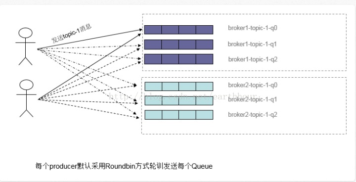
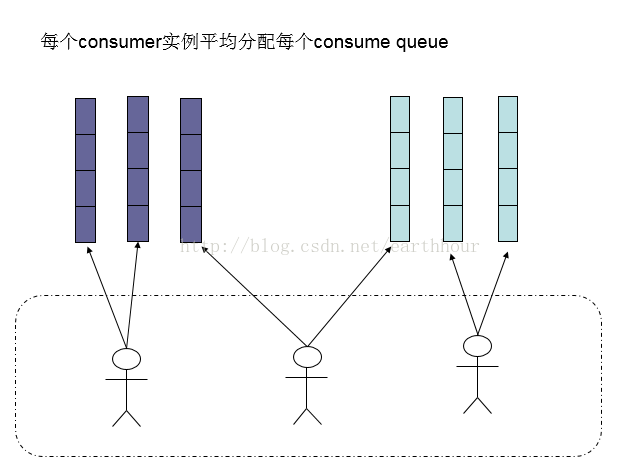
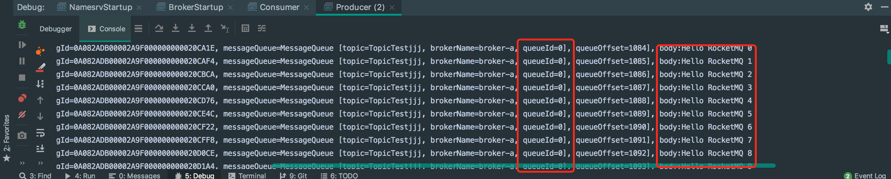
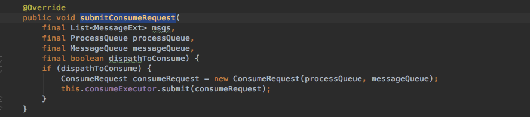
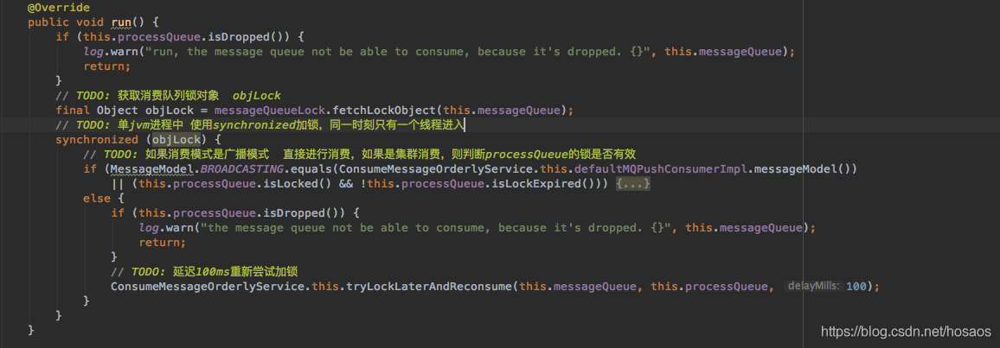
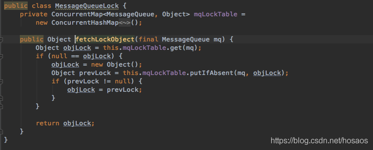

# 消息顺序消费

消息有序指的是可以按照消息的发送顺序来消费。
RocketMQ可以严格的保证消息有序。但这个顺序，不是全局顺序，只是分区（queue）顺序。要全局顺序只能一个分区。

之所以出现你这个场景看起来不是顺序的，是因为发送消息的时候，消息发送默认是会采用轮询的方式发送到不通的queue（分区）。如图：



而消费端消费的时候，是会分配到多个queue的，多个queue是同时拉取提交消费。如图：



问题1:

但是同一条queue里面，RocketMQ的确是能保证FIFO的。那么要做到顺序消息，应该怎么实现呢——把消息确保投递到同一条queue。

## 全局顺序消费

  什么是全局顺序消费？所有发到mq的消息都被顺序消费，类似数据库中的binlog，需要严格保证全局操作的顺序性

  那么RocketMQ中如何做才能保证全局顺序消费呢？

  这就需要设置topic下读写队列数量为1

**为什么要设置读写队列数量为1呢？**
  假设读写队列有多个，消息就会存储在多个队列中，消费者负载时可能会分配到多个消费队列同时进行消费，多队列并发消费时，无法保证消息消费顺序性

 **那么全局顺序消费有必要么？**
  A、B都下了单，B用户订单的邮件先发送，A的后发送，不行么？其实，大多数场景下，mq下只需要保证局部消息顺序即可，即A的付款消息先于A的发货消息即可，A的消息和B的消息可以打乱，这样系统的吞吐量会更好，将队列数量置为1，极大的降低了系统的吞吐量，不符合mq的设计初衷

  举个例子来说明局部顺序消费。假设订单A的消息为A1，A2，A3，发送顺序也如此。订单B的消息为B1，B2，B3，A订单消息先发送，B订单消息后发送

  消费顺序如下
  A1，A2，A3，B1，B2，B3是全局顺序消息，严重降低了系统的并发度
  A1，B1，A2，A3，B2，B3是局部顺序消息，可以被接受
  A2，B1，A1，B2，A3，B3不可接收，因为A2出现在了A1的前面

## 局部顺序消费

  那么在RocketMQ里局部顺序消息又是如何怎么实现的呢？

  要保证消息的顺序消费，有三个关键点

  1. 消息顺序发送
  2. 消息顺序存储
  3. 消息顺序消费

  第一点，消息顺序发送，多线程发送的消息无法保证有序性，因此，需要业务方在发送时，针对同一个业务编号(如同一笔订单)的消息需要保证在一个线程内顺序发送，在上一个消息发送成功后，在进行下一个消息的发送。对应到mq中，消息发送方法就得使用同步发送，异步发送无法保证顺序性

  第二点，消息顺序存储，mq的topic下会存在多个queue，要保证消息的顺序存储，同一个业务编号的消息需要被发送到一个queue中。对应到mq中，需要使用MessageQueueSelector来选择要发送的queue，即对业务编号进行hash，然后根据队列数量对hash值取余，将消息发送到一个queue中

  第三点，消息顺序消费，要保证消息顺序消费，同一个queue就只能被一个消费者所消费，因此对broker中消费队列加锁是无法避免的。同一时刻，一个消费队列只能被一个消费者消费，消费者内部，也只能有一个消费线程来消费该队列。即，同一时刻，一个消费队列只能被一个消费者中的一个线程消费


### 局部顺序消费demo

```java
public class Producer {
    public static void main(String[] args) throws UnsupportedEncodingException {
        try {
            DefaultMQProducer producer = new DefaultMQProducer("please_rename_unique_group_name");
            producer.setNamesrvAddr("127.0.0.1:9876");
            producer.setSendMsgTimeout(30000);
            producer.start();

            for (int i = 0; i < 100; i++) {
                //int orderId = i % 10;
                //设置orderId为0,表示所有的消息分配到同一个MessageQueue
                int orderId = 0;
                Message msg =
                    new Message("TopicTestjjj", "tagA", "KEY" + i,
                        ("Hello RocketMQ " + i).getBytes(RemotingHelper.DEFAULT_CHARSET));
                SendResult sendResult = producer.send(msg, new MessageQueueSelector() {
                    /**
                     *
                     * @param mqs
                     * @param msg
                     * @param arg 传入进来的参数,此处是orderId的值0,用来计算分配到那个MessageQueue
                     * @return org.apache.rocketmq.common.message.MessageQueue
                     * @author chenqi
                     * @date 2021/1/13 14:50
                     */
                    @Override
                    public MessageQueue select(List<MessageQueue> mqs, Message msg, Object arg) {
                        Integer id = (Integer) arg;
                        // orderId%mqs.size()  mqs.size() 默认为4
                        int index = id % mqs.size();
                        return mqs.get(index);
                    }
                }, orderId);
                System.out.println(" body:" + new String(msg.getBody()));
                //System.out.printf("%s%n", sendResult);

            }

            producer.shutdown();
        } catch (MQClientException | RemotingException | MQBrokerException | InterruptedException e) {
            e.printStackTrace();
        }
    }
}

```

```java
public class Consumer {

    public static void main(String[] args) throws MQClientException {
        DefaultMQPushConsumer consumer = new DefaultMQPushConsumer("order_Consumer");
        consumer.setNamesrvAddr("127.0.0.1:9876");

        /**
         * 设置Consumer第一次启动是从队列头部开始消费还是队列尾部开始消费<br>
         * 如果非第一次启动，那么按照上次消费的位置继续消费
         */
        consumer.setConsumeFromWhere(ConsumeFromWhere.CONSUME_FROM_FIRST_OFFSET);

        consumer.subscribe("TopicTestjjj", "*");

        consumer.registerMessageListener(new MessageListenerOrderly() {
            AtomicLong consumeTimes = new AtomicLong(0);

            public ConsumeOrderlyStatus consumeMessage(List<MessageExt> msgs, ConsumeOrderlyContext context) {
                // 设置自动提交
                context.setAutoCommit(true);
                for (MessageExt msg : msgs) {
                    System.out.println("内容：" + new String(msg.getBody()));
                }

                return ConsumeOrderlyStatus.SUCCESS;
            }
        });

        consumer.start();

        System.out.println("Consumer Started.");
    }

}
```

运行上面代码发现消息发送和消息消费都是顺序消费,`producer`的`queueId`会都落在0上(实现`MessageQueueSelector`)

问题1已经成功解决




继续思考,如果多个consumer同时进行消费,消息会怎么分布?

一个队列只被一个消费者消费,一个消费者只有一个线程消费.

### 锁定MessageQueue

消费队列存在于broker端，如果想保证一个队列被一个消费者消费，那么消费者在进行消息拉取消费时就必须像mq服务器申请队列锁，消费者申请队列锁的代码存在于`RebalanceServiceImpl#updateProcessQueueTableInRebalance`消息队列负载的实现代码中

```java
List<PullRequest> pullRequestList = new ArrayList<PullRequest>();
        for (MessageQueue mq : mqSet) {
            if (!this.processQueueTable.containsKey(mq)) {
                //顺序消息首先加锁
                if (isOrder && !this.lock(mq)) {
                    log.warn("doRebalance, {}, add a new mq failed, {}, because lock failed", consumerGroup, mq);
                    continue;
                }

                this.removeDirtyOffset(mq);
                ProcessQueue pq = new ProcessQueue();
                long nextOffset = this.computePullFromWhere(mq);
```

上面代码`lock`保证了拉取消息的时候 一个messageQueue只能被一个消费者消费

### 消息拉取

`DefaultMQPushConsumerImpl#pullMessage`加锁拉取消息,如果加锁失败则放入延迟队列

```java
if (!this.consumeOrderly) {
            //...
        } //processQueue加锁
            if (processQueue.isLocked()) {
                //如果该队列是第一次拉取任务
                if (!pullRequest.isLockedFirst()) {
                    final long offset = this.rebalanceImpl.computePullFromWhere(pullRequest.getMessageQueue());
                    boolean brokerBusy = offset < pullRequest.getNextOffset();
                    log.info("the first time to pull message, so fix offset from broker. pullRequest: {} NewOffset: {} brokerBusy: {}",
                        pullRequest, offset, brokerBusy);
                    if (brokerBusy) {
                        log.info("[NOTIFYME]the first time to pull message, but pull request offset larger than broker consume offset. pullRequest: {} NewOffset: {}",
                            pullRequest, offset);
                    }

                    pullRequest.setLockedFirst(true);
                    pullRequest.setNextOffset(offset);
                }
            } else {
                //延迟3秒在拉取
                this.executePullRequestLater(pullRequest, pullTimeDelayMillsWhenException);
                log.info("pull message later because not locked in broker, {}", pullRequest);
                return;
            }
```

### 消息消费

`PullMessage`时提交消息请求

```java
//提交请求到消息消费的线程池中
DefaultMQPushConsumerImpl.this.consumeMessageService.submitConsumeRequest(
    pullResult.getMsgFoundList(),
    processQueue,
    pullRequest.getMessageQueue(),
    dispatchToConsume);
```

消息顺序消费的是需要实现类为`ConsumeMessageOrderlyService`



可以看到，构建了一个ConsumeRequest对象，并提交给了ThreadPoolExecutor来并行消费，看下顺序消费的ConsumeRequest的run方法实现



里面先从messageQueueLock中获取了messageQueue对应的一个锁对象，看下messageQueueLock的实现



其中维护了一个ConcurrentMap<MessageQueue, Object> mqLockTable，使得一个messageQueue对应一个锁对象object

获取到锁对象后，使用synchronized尝试申请线程级独占锁

1. 如果加锁成功，同一时刻只有一个线程进行消息消费
2. 如果加锁失败，会延迟100ms重新尝试向broker端申请锁定messageQueue，锁定成功后重新提交消费请求

至此，第三个关键点的解决思路也清晰了，基本上就两个步骤

1. 创建消息拉取任务时，消息客户端向broker端申请锁定MessageQueue，使得一个MessageQueue同一个时刻只能被一个消费客户端消费
2. 消息消费时，多线程针对同一个消息队列的消费先尝试使用synchronized申请独占锁，加锁成功才能进行消费，使得一个MessageQueue同一个时刻只能被一个消费客户端中一个线程消费